<div align="center">

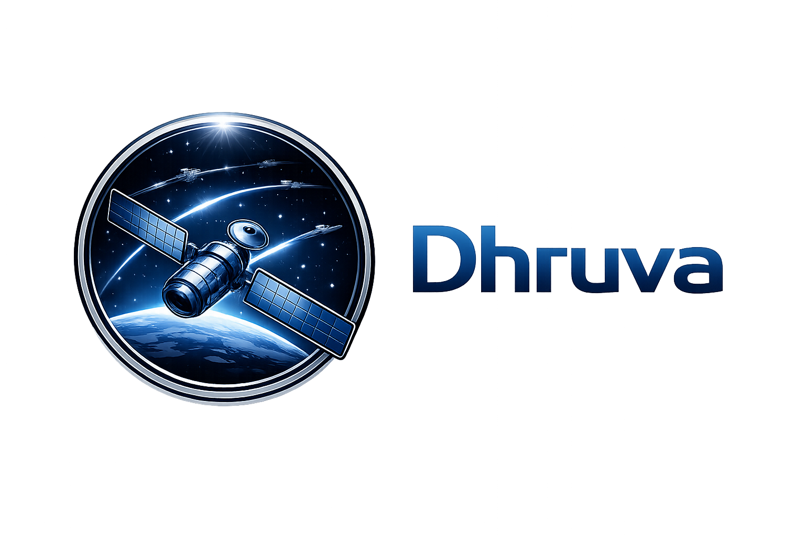

**Autonomous Constellation Management & Conjunction Decision Support Platform**

[](https://github.com/jeevankumar-m/project-dhruva/stargazers) [](https://github.com/jeevankumar-m/project-dhruva/watchers) [](https://github.com/jeevankumar-m/project-dhruva/network/members) [](https://github.com/jeevankumar-m/project-dhruva#quick-start)

</div>

---

## Table of Contents

- [Overview](#overview)
- [Key Features](#key-features)
- [Screenshots](#screenshots)
- [System Architecture](#system-architecture)
- [Repository Structure](#repository-structure)
- [Prerequisites](#prerequisites)
- [Quick Start](#quick-start)
- [Backend Setup](#backend-setup)
- [Frontend Setup](#frontend-setup)
- [API Reference](#api-reference)
- [WebSocket Stream](#websocket-stream)
- [How to Add Satellite and Debris Data](#how-to-add-satellite-and-debris-data)
- [Testing Guide](#testing-guide)
- [Physics Model Summary](#physics-model-summary)
- [Operational Limits and Constraints](#operational-limits-and-constraints)
- [Troubleshooting](#troubleshooting)

---

## Overview

Dhruva CDM simulates satellite and debris motion in Earth orbit, evaluates close-approach risk, and supports maneuver scheduling with operational constraints such as communication blackout windows, command latency, cooldown constraints, and fuel feasibility.

The platform has two primary execution modes:

- `Live Stream Mode`: optimized for UI smoothness, uses WebSocket snapshots and grid-based conjunction prefiltering.
- `Step/Batch Mode`: optimized for backend evaluation speed, uses step-based simulation and KD-tree conjunction prefiltering.

---

## Key Features

- Real-time orbit visualization and conjunction updates over WebSocket.
- Conjunction warning generation with `SAFE`, `WARNING`, `CRITICAL` risk levels.
- Maneuver scheduling API with LOS, fuel, latency, and cooldown validations.
- TLE ingestion pipeline with SGP4 propagation and frame transformation to simulation state vectors.
- CDM-style CSV stress-loading pipeline for large debris test campaigns.
- Blackout status estimation and recovery ETA.
- Autonomous graveyard routing based on low-fuel threshold.
- Mission metrics: fuel usage, uptime, outage accumulation, and avoidance efficiency.
- Frontend dashboard with 2D Mercator ground track (90-min historical trail + dashed 90-min predicted trajectory, accurate terminator line), 3D Cesium orbit view, conjunction bullseye plot, maneuver Gantt timeline, and dedicated fleet fuel page.

---

## Screenshots

### 1. Ground Track — 2D Map Dashboard
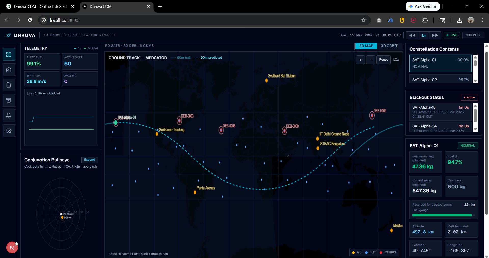

Main dashboard displaying the real-time ground track of the constellation on a 2D Mercator map. Shows satellite positions, ground station overlays (e.g., Goldstone Tracking, IIT Delhi Ground Node, ISTRAC Bengaluru), telemetry summary (link quality, velocity), constellation contents, and active blackout status for each satellite.

---

### 2. Dashboard with Maneuver Timeline
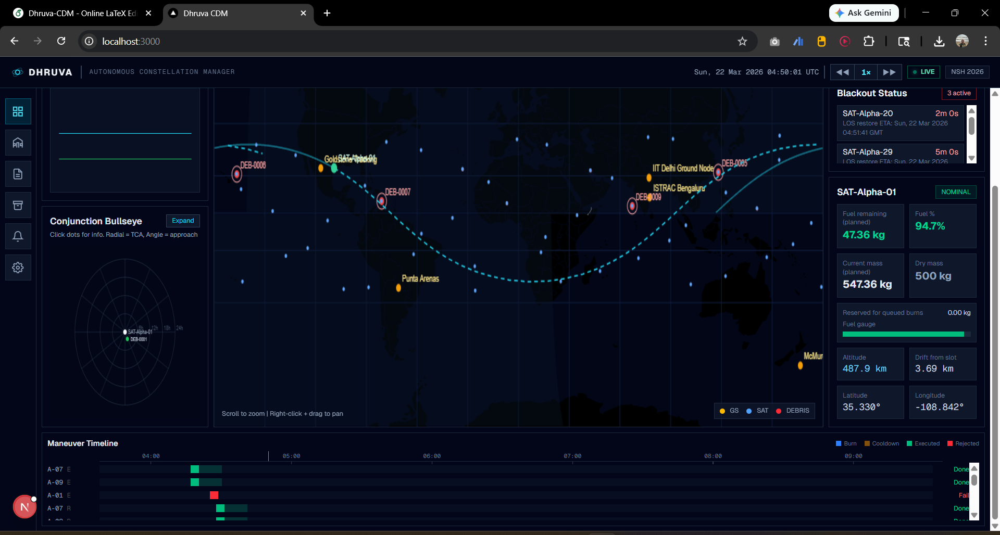

Extended dashboard view showing the ground track alongside the **Maneuver Timeline** panel at the bottom, which visualizes scheduled and executed burns across the simulation stream for each satellite in the fleet.

---

### 3. 3D Orbit Tracker — Polar View (Cesium)
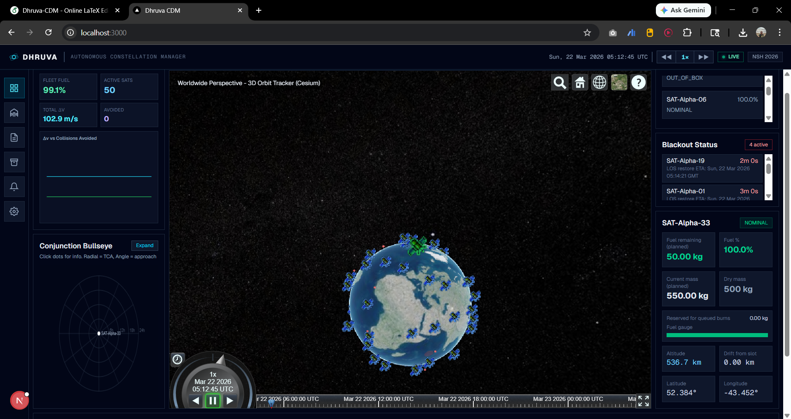

Worldwide 3D perspective of the constellation using the Cesium globe renderer, viewed from a polar angle. Satellites and their orbital trails are rendered on the Earth's surface, with constellation health and blackout status displayed on the right panel.

---

### 4. 3D Orbit Tracker — Close Orbit View (Cesium)
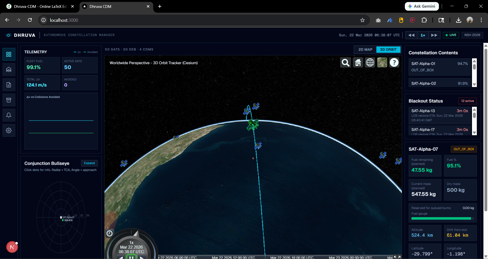

Close-up 3D orbit view showing a satellite's orbital ground track arcing over a landmass. Highlights individual satellite telemetry (SAT-Alpha-07) including fuel mass, dry mass, altitude, and longitude on the right panel. Blackout events for multiple satellites are also listed.

---

### 5. 3D Orbit Tracker — Full Constellation Globe View (Cesium)
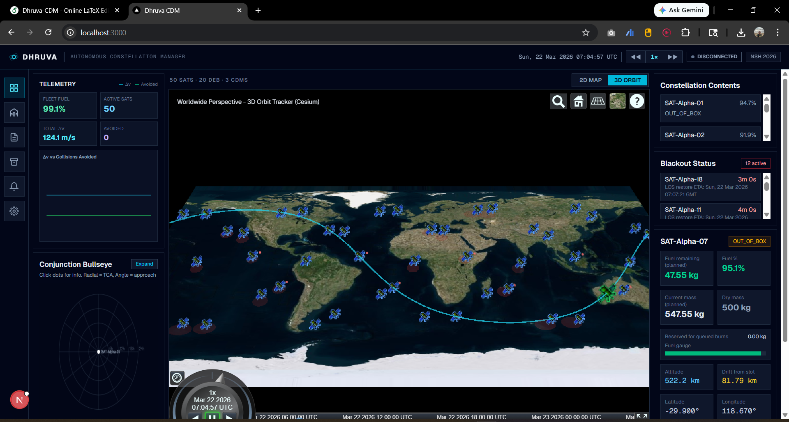

Full worldwide 3D globe view of the entire constellation with all satellite positions and orbital tracks rendered simultaneously, giving an at-a-glance overview of fleet coverage and spacing.

---

### 6. Conjunction Bullseye — Extended View
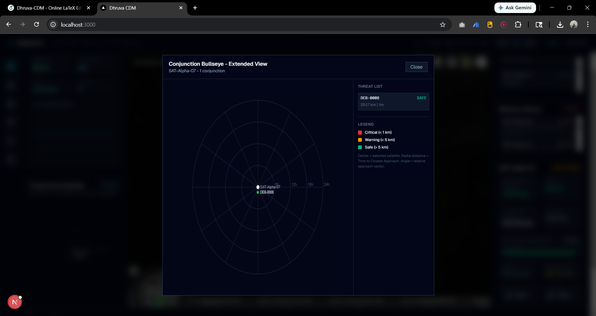

Enlarged conjunction bullseye radar plot for a selected satellite (SAT-Alpha-07). Displays the predicted closest approach point relative to the satellite's reference frame, with colour-coded risk zones (Dhruva 1 km, Warning 2 km, Outer 5 km) and a conjunction list with miss distances.

---

### 7. Fleet Fuel & ΔV Analysis
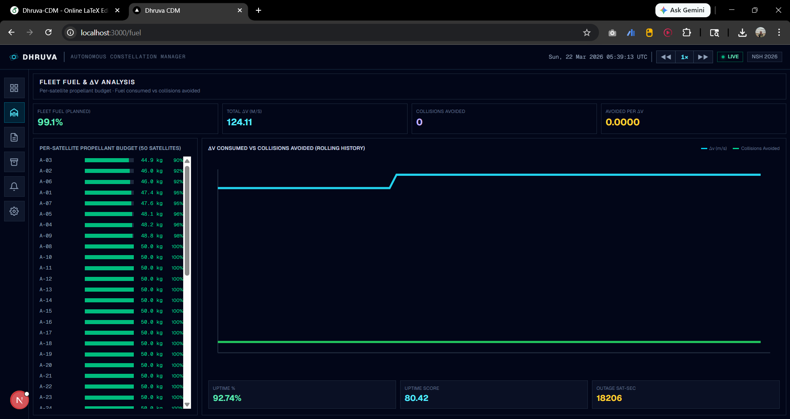

Fleet-wide fuel and delta-V analytics page. Shows per-satellite propellant budget bars, total ΔV consumed (124.11 m/s), collision avoidance score, and a rolling history chart comparing ΔV consumed against collisions avoided over the simulation window.

---

### 8. Reports — Burn Logs
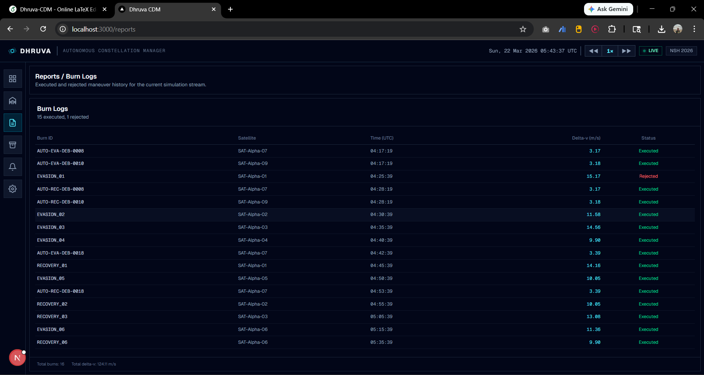

Reports section listing the full burn log for the current simulation stream. Each entry shows the burn ID, satellite, time (UTC), delta-V in m/s, and execution status (Executed / Rejected), providing a complete audit trail of all maneuver decisions.

---

### 9. Graveyard Orbit Monitor
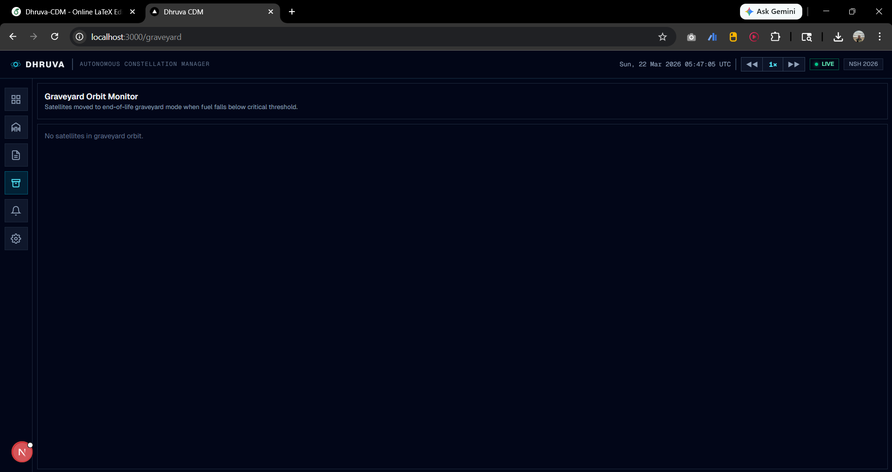

Graveyard orbit monitor that automatically tracks satellites moved to graveyard mode when their fuel falls below the critical threshold. Displays satellite ID and the trigger condition, ensuring decommissioned assets are flagged and tracked.

---

### 10. CDM Alerts
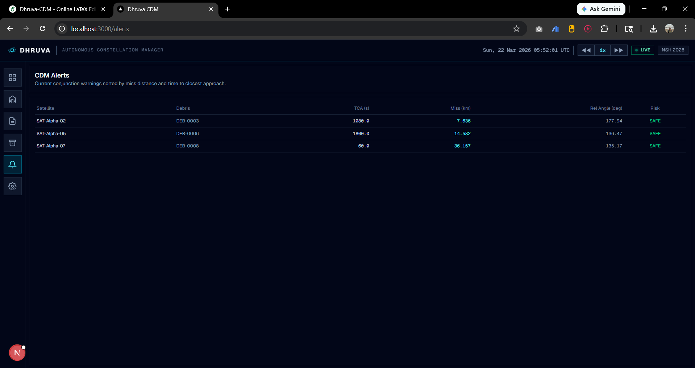

Conjunction Data Message (CDM) alerts dashboard showing current active conjunction warnings for the fleet. Entries are sorted by miss distance and time to closest approach, with columns for satellite, debris object, miss distance, time range, and alert level.

---

### 11. Genesis Engine — Collision Prediction (Pre-Maneuver)
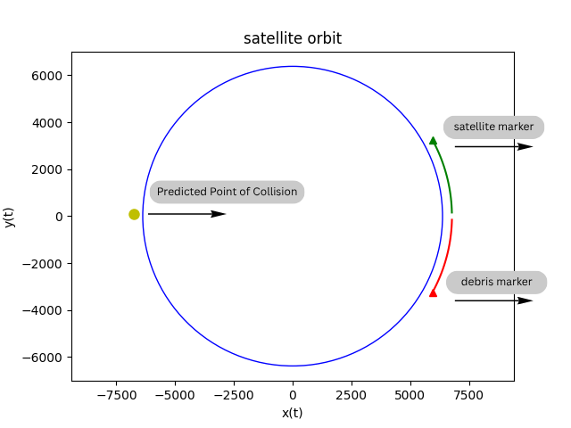

Orbital plot from the Genesis autonomous maneuver planning engine showing the predicted point of collision between a satellite (green marker) and debris (red marker) before any avoidance burn is executed. The predicted collision point is highlighted on the orbit circle.

---

### 12. Genesis Engine — Collision Prediction (Alternate Geometry)
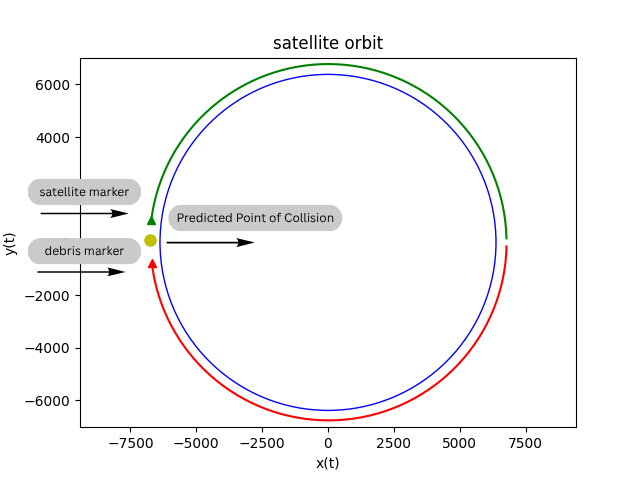

Another Genesis orbital plot showing a close-approach scenario where the satellite and debris tracks converge. The predicted collision point shifts depending on the relative geometry of the two objects' orbits.

---

### 13. Genesis Engine — Post-Maneuver Avoidance Visualization
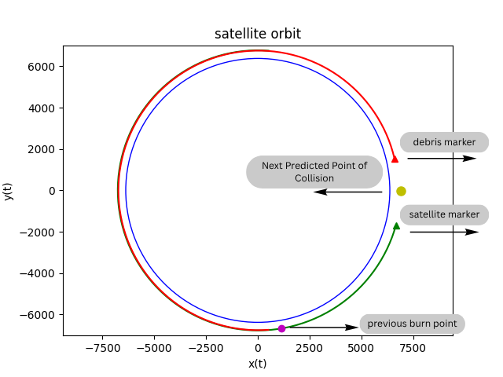

Post-maneuver Genesis plot showing the **next predicted point of collision** after a burn has been executed. The previous burn point (magenta) is marked on the orbit, and the satellite's new orbital path (green) diverges from the debris track (red), confirming a successful avoidance trajectory.

---

## System Architecture

- Backend: `FastAPI` application in `server.py` and `api/routes.py`.
- State/physics core: `engine/sim_state.py`, `engine/conjunction.py`, `physics.py`.
- Frontend: `Next.js` application in `dhruva-frontend/`.
- Live transport: WebSocket endpoint at `WS /orbit`.
- Snapshot endpoint: `GET /api/visualization/snapshot`.

Data flow:

1. Objects are ingested (`/api/telemetry`, `/api/telemetry/tle`, or `/api/debug/load_cdm_csv`).
2. State is propagated using RK4 with central gravity + J2 perturbation.
3. Conjunction candidates are filtered (`grid` or `kdtree`) and evaluated over a prediction horizon.
4. Warnings and metrics are exposed through snapshot and stream payloads.
5. Frontend renders map/3D/orbit/analytics panels from backend output.

---

## Repository Structure

```text
Project-dhruva/
├── server.py                    # FastAPI app + websocket stream loop
├── api/
│   └── routes.py                # REST API endpoints
├── engine/
│   ├── sim_state.py             # Core simulation state and mission logic
│   ├── conjunction.py           # Grid/KD-tree conjunction filtering and TCA prediction
│   ├── tle_utils.py             # TLE -> state vector transformation
│   ├── coordinates.py           # ECI/geodetic transforms
│   ├── los.py                   # Ground-station LOS logic
│   └── models.py                # Domain models
├── physics.py                   # Orbital dynamics and fuel model
├── simulator.py                 # Early Matplotlib prototype
├── test_data/
│   └── debris_data.csv          # CDM-style stress test data
├── dhruva-frontend/             # Next.js frontend
├── Dockerfile                   # Docker image (backend + frontend)
└── README.md
```

---

## Prerequisites

- Docker Desktop (recommended) for backend.
- Node.js 18+ and npm for frontend.
- Optional local backend: Python 3.11+ with pip.

---

## Quick Start

Run both backend and frontend with a single command:

```bash
docker build -t dhruva-cdm . && docker run --rm -p 8000:8000 -p 3000:3000 dhruva-cdm
```

Open:

- Backend health: `http://localhost:8000/`
- Frontend: `http://localhost:3000`

---

## Backend Setup

### Option A: Docker (recommended)

```bash
docker build -t dhruva-cdm . && docker run --rm -p 8000:8000 -p 3000:3000 dhruva-cdm
```

Notes:

- The Dockerfile builds and runs both the FastAPI backend (port 8000) and Next.js frontend (port 3000) in a single container.
- The Dockerfile installs `uvicorn[standard]` to include WebSocket support libraries.
- If port `8000` or `3000` is busy, stop the processes using them before running.

Health check:

```bash
curl http://localhost:8000/
```

Expected response:

```json
{
  "status": "ok",
  "service": "dhruva-cdm"
}
```

### Option B: Local Python (alternative)

```bash
pip install -r requirements.txt
pip install sgp4 astropy
uvicorn server:app --host 0.0.0.0 --port 8000 --reload
```

---

## Frontend Setup

```bash
cd dhruva-frontend
npm install
npm run dev
```

Default URL: `http://localhost:3000`

### Frontend Pages

| Route | Description |
|---|---|
| `/` | Main dashboard — ground track map (2D/3D), conjunction bullseye, maneuver timeline, satellite detail |
| `/fuel` | Fleet fuel — per-satellite propellant gauges, ∆v vs collisions avoided chart, mission scoring |
| `/reports` | Burn logs — full maneuver history |
| `/graveyard` | Graveyard orbit — end-of-life satellites |
| `/alerts` | CDM alerts — active conjunction warnings |
| `/analytics` | Analytics — fleet-level trends and conjunction table |

---

## API Reference

Base URL: `http://localhost:8000`

### 1) `POST /api/telemetry`

Ingest absolute Cartesian state vectors.

Request body:

```json
{
  "timestamp": "2026-03-21T05:30:00Z",
  "objects": [
    {
      "id": "SAT-CUSTOM-001",
      "type": "SATELLITE",
      "r": { "x": 6878.0, "y": 0.0, "z": 0.0 },
      "v": { "x": 0.0, "y": 7.6, "z": 0.2 }
    },
    {
      "id": "DEB-CUSTOM-001",
      "type": "DEBRIS",
      "r": { "x": 6878.5, "y": 1.0, "z": -0.1 },
      "v": { "x": 0.0, "y": 7.59, "z": 0.2 }
    }
  ]
}
```

Response:

```json
{
  "status": "ACK",
  "processed_count": 2,
  "active_cdm_warnings": 0
}
```

### 2) `POST /api/telemetry/tle`

Ingest TLE objects. Backend performs SGP4 + TEME to GCRS conversion and stores resulting state vectors.

Request body:

```json
{
  "objects": [
    {
      "id": "TLE-ISS-25544",
      "object_type": "SATELLITE",
      "tle_line1": "1 25544U 98067A   26079.87218434  .00009590  00000+0  18573-3 0  9990",
      "tle_line2": "2 25544  51.6346  17.0785 0006366 213.2716 146.7873 15.48402839558062",
      "timestamp": "2026-03-21T05:34:37Z"
    }
  ]
}
```

Response:

```json
{
  "status": "ACK",
  "processed_count": 1,
  "active_cdm_warnings": 3,
  "last_timestamp": "2026-03-21T05:34:37+00:00"
}
```

### 3) `POST /api/maneuver/schedule`

Submit one or more burns for a satellite.

Request body:

```json
{
  "satelliteId": "SAT-Alpha-01",
  "maneuver_sequence": [
    {
      "burn_id": "TEST-EVA-001",
      "burnTime": "2026-03-21T05:40:00Z",
      "deltaV_vector": { "x": 0.0, "y": 0.003, "z": 0.0 }
    }
  ]
}
```

Response (202):

```json
{
  "status": "SCHEDULED",
  "validation": {
    "ground_station_los": true,
    "sufficient_fuel": true,
    "projected_mass_remaining_kg": 544.82
  }
}
```

Possible statuses:

- `SCHEDULED`
- `REJECTED`

### 4) `POST /api/simulate/step`

Advance simulation in batch mode.

Request body:

```json
{
  "step_seconds": 300
}
```

Response:

```json
{
  "status": "STEP_COMPLETE",
  "new_timestamp": "2026-03-21T05:45:00+00:00",
  "collisions_detected": 0,
  "maneuvers_executed": 1
}
```

### 5) `GET /api/visualization/snapshot`

Read full state payload for visualization and analysis.

Response shape (trimmed):

```json
{
  "timestamp": "2026-03-21T05:45:00+00:00",
  "satellites": [
    {
      "id": "SAT-Alpha-01",
      "lat": 12.3,
      "lon": 82.1,
      "altitude_km": 512.4,
      "fuel_kg": 49.8,
      "status": "NOMINAL",
      "drift_km": 2.1,
      "eci": { "x": 6800.0, "y": 10.0, "z": 30.0, "vx": 0.0, "vy": 7.6, "vz": 0.1 }
    }
  ],
  "debris_cloud": [
    ["DEB-0001", 13.2, 83.0, 520.1]
  ],
  "conjunctions": [
    {
      "satellite_id": "SAT-Alpha-01",
      "debris_id": "DEB-0001",
      "tca_seconds": 420.0,
      "miss_distance_km": 2.4,
      "relative_angle_deg": -23.8,
      "risk_level": "WARNING"
    }
  ],
  "metrics": {
    "fleet_fuel_pct": 97.2,
    "collisions_avoided": 12,
    "uptime_pct": 99.1,
    "uptime_score": 97.4,
    "avoidance_per_delta_v": 0.08,
    "time_warp_x": 1
  },
  "counts": {
    "satellites": 50,
    "debris": 10020,
    "conjunction_warnings": 9,
    "graveyard": 0
  },
  "blackout_status": [
    {
      "satellite_id": "SAT-Alpha-01",
      "in_blackout": false,
      "estimated_recovery_seconds": null,
      "estimated_recovery_timestamp": null
    }
  ]
}
```

### 6) `POST /api/debug/seed`

Reset scenario with synthetic constellation + debris.

Request body:

```json
{
  "satellite_count": 50,
  "debris_count": 20
}
```

Limits:

- `satellite_count`: `1..200`
- `debris_count`: `1..20000`

Response:

```json
{
  "status": "SEEDED",
  "satellites": 50,
  "debris": 20,
  "active_cdm_warnings": 4
}
```

### 7) `POST /api/debug/load_cdm_csv`

Load CDM-style debris features from CSV for stress testing.

Request body:

```json
{
  "csv_path": "test_data/debris_data.csv",
  "max_rows": 10000,
  "replace_existing": false,
  "id_prefix": "CDM-DEB"
}
```

Limits:

- `max_rows`: `1..20000`

Response:

```json
{
  "status": "LOADED",
  "source_csv": "C:\\Users\\...\\test_data\\debris_data.csv",
  "loaded": 10000,
  "skipped": 0,
  "debris_total": 10020,
  "active_cdm_warnings": 9,
  "note": "CDM relative RTN fields were converted to ECI-like states using mission-anchored satellites."
}
```

Important interpretation note:

- This CSV path is excellent for load/performance and pipeline testing.
- It contains relative encounter features, not absolute truth ephemerides for each object.

### 8) `GET /api/sim/timewarp`

Response:

```json
{
  "time_warp_x": 1
}
```

### 9) `POST /api/sim/timewarp`

Request body:

```json
{
  "multiplier": 10
}
```

Allowed multipliers:

- `1`, `2`, `10`, `25`, `100`

Response:

```json
{
  "status": "UPDATED",
  "time_warp_x": 10
}
```

---

## WebSocket Stream

Endpoint:

- `WS /orbit`

Behavior:

- Opens persistent connection.
- Advances simulation and pushes snapshot payload repeatedly.
- Payload schema mirrors `GET /api/visualization/snapshot`.

Minimal client test (browser console):

```javascript
const ws = new WebSocket("ws://localhost:8000/orbit");
ws.onmessage = (evt) => {
  const data = JSON.parse(evt.data);
  console.log(data.timestamp, data.counts);
};
```

---

## How to Add Satellite and Debris Data

### Add absolute state vectors directly

Use `POST /api/telemetry` with objects of type `SATELLITE` and/or `DEBRIS`.

Use this when you already have Cartesian ECI-like state vectors:

- Position in km: `x, y, z`
- Velocity in km/s: `vx, vy, vz`

### Add catalog data via TLE

Use `POST /api/telemetry/tle` with valid TLE lines and timestamp.

Use this when you have NORAD/CelesTrak style inputs and want backend conversion handled automatically.

### Add large synthetic stress datasets

Use `POST /api/debug/load_cdm_csv` for CDM-style relative fields in `test_data/debris_data.csv`.

Use this for high-volume performance testing and warning pipeline validation.

---

## Testing Guide

### A) Basic health and startup

1. Start backend (`docker` or local).
2. Verify `GET /`.
3. Start frontend and open `http://localhost:3000`.

### B) Seed and snapshot validation

1. `POST /api/debug/seed` with baseline counts.
2. `GET /api/visualization/snapshot`.
3. Verify:
   - `counts.satellites`
   - `counts.debris`
   - `metrics` fields present
   - `blackout_status` array populated

### C) Maneuver validation test

1. Submit future burn with `POST /api/maneuver/schedule`.
2. Advance with `POST /api/simulate/step`.
3. Verify in snapshot:
   - Burn appears in `maneuvers` and/or `burn_logs`.
   - Fuel decreases for target satellite.

### D) High-volume debris stress test

1. Seed baseline.
2. `POST /api/debug/load_cdm_csv` with `max_rows=10000`.
3. Verify snapshot counts and conjunction warnings.
4. Observe frontend responsiveness and warning updates.

### E) WebSocket stream test

1. Connect to `WS /orbit`.
2. Confirm timestamps and counts are updating.
3. Confirm frontend bullseye/warning panels change live.

---

## Physics Model Summary

Implemented in `physics.py`:

- Two-body central gravity:
  - `a = -(MU / |r|^3) * r`
- J2 perturbation term:
  - Earth oblateness correction applied component-wise to acceleration.
- Numerical integration:
  - RK4 (`rk4_step`) for state propagation.
- Fuel estimation:
  - Tsiolkovsky equation for burn propellant mass usage.
- Orbital period utility:
  - `T = 2 * pi * sqrt(a^3 / MU)`.

Units:

- Position: km
- Velocity: km/s
- Delta-v (burn feasibility): m/s in fuel equation after conversion

---

## Operational Limits and Constraints

- `POST /api/debug/seed`
  - satellites: `1..200`
  - debris: `1..20000`
- `POST /api/debug/load_cdm_csv`
  - max_rows: `1..20000`
- `POST /api/sim/timewarp`
  - allowed multipliers: `[1, 2, 10, 25, 100]`
- Maneuvers are rejected if violating:
  - line-of-sight upload requirement
  - minimum command latency
  - thermal cooldown
  - per-burn and total fuel feasibility

---

## Troubleshooting

### Docker startup issues on Windows

- Ensure Docker Desktop is running.
- Ensure WSL2 and virtualization are enabled.
- Check:
  - `wsl --status`
  - `docker info`

### WebSocket warning in backend logs

If you see unsupported WebSocket library warnings, ensure backend uses `uvicorn[standard]`.

### Frontend cannot reach backend

- Ensure backend is on `http://localhost:8000`.
- Ensure frontend is on `http://localhost:3000`.
- Check CORS settings in `server.py`.

### Port already in use

- Stop existing process on `8000`, then re-run backend.
- Or map Docker container to another host port if needed.

---

## License

MIT License

Copyright (c) 2026 M. Jeevan Kumar

Permission is hereby granted, free of charge, to any person obtaining a copy
of this software and associated documentation files (the "Software"), to deal
in the Software without restriction, including without limitation the rights
to use, copy, modify, merge, publish, distribute, sublicense, and/or sell
copies of the Software, and to permit persons to whom the Software is
furnished to do so, subject to the following conditions:

The above copyright notice and this permission notice shall be included in all
copies or substantial portions of the Software.

THE SOFTWARE IS PROVIDED "AS IS", WITHOUT WARRANTY OF ANY KIND, EXPRESS OR
IMPLIED, INCLUDING BUT NOT LIMITED TO THE WARRANTIES OF MERCHANTABILITY,
FITNESS FOR A PARTICULAR PURPOSE AND NONINFRINGEMENT. IN NO EVENT SHALL THE
AUTHORS OR COPYRIGHT HOLDERS BE LIABLE FOR ANY CLAIM, DAMAGES OR OTHER
LIABILITY, WHETHER IN AN ACTION OF CONTRACT, TORT OR OTHERWISE, ARISING FROM,
OUT OF OR IN CONNECTION WITH THE SOFTWARE OR THE USE OR OTHER DEALINGS IN THE
SOFTWARE.
